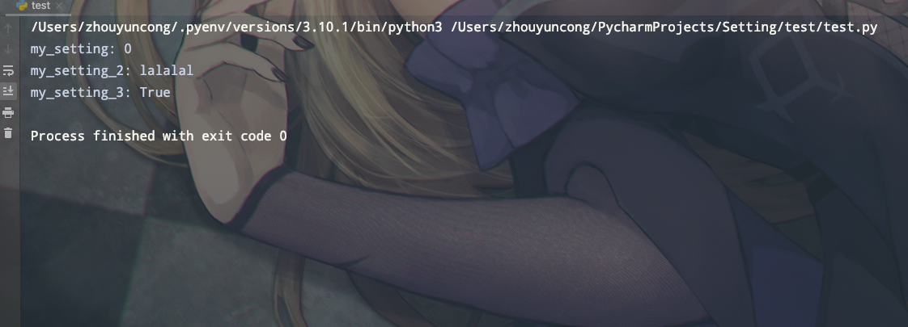
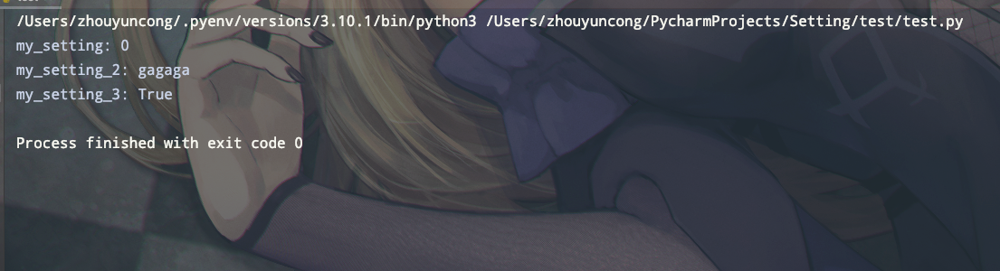

<div align="center" >
 
    <p >⚠️  一款<b >通用型</b>多环境设置管理工具  ⚠️</p>
    <p >⚠️ 彻底解决多套运行环境需要重复编写常量及设置内容  ⚠️</p>


</div>

<HR >
<div align="center" >
<p align="center">无需修改一行代码，即可实现多套设置间的无缝切换</p>
</div>

## 项目说明

本项目的所有设置均使用 **Class** 进行保存， 多套设置间支持 **继承**｜**重载** 等操作， 可以方便的进行多环境的设置。


<p style="display: flex;align-items: center">
项目全部代码都使用了

的类型声明功能，将会为本项目使用时带来更好的使用体验和类型预测。
</p>

<p style="display: flex;align-items: center">
同时也导致本项目需要在版本下运行
</p>

> 💡 提示: 有关 Python 的类型声明请参考 <a href="https://docs.python.org/zh-cn/3/library/typing.html">《官方文档》</a>

### 使用场景
通常我们本地，测试，生产环境所使用的设置及常量都不一样，我们每切换一个环境时都要对相关的代码或文件进行修改或编辑，导致工作量大大增加。
所以我们需要一个方便的工具， 可以方便的进行多环境的设置。

与docker搭配能更大的发挥本项目的作用， 可以让我们的工作量更加简单，更加方便。
## 安装

> 由于目前本项目尚未发布于 pypi 所以仅支持从源代码安装

### 1. 从源代码中安装

```bash
python setup.py install
```

## 快速入门

下面将快速的讲解如何使用NnSetting，并且提供一些常用的操作。
> 💡 提示: 有关 Python 的范型声明请参考 <a href="https://docs.python.org/zh-cn/3/library/typing.html#generics">《官方文档 : 泛型》</a>

### 声明一个自己的设置类，并初始化NnSetting

```python
# 1. 导入NnSetting 及 相关依赖项
from NnSetting import NnSetting, DefaultSettings, Property
from typing import Type  # python的范型声明库
from NnSetting.Source import EnvSource  # 导入设置源，他负责告诉NnSetting启用那个设置


# 2. 创建一个设置类 ⚠️ ： 每个设置类都需要继承自DefaultSettings
class MySetting(DefaultSettings):
    # 3. 定义设置属性
    # ⚠️ 属性类型可以是任意类型, 但需要使用Property进行声明
    my_setting: int = Property(0)  # 定义一个整数属性
    my_setting_2: str = Property("lalalal")  # 定义一个字符串属性
    my_setting_3: bool = Property(True)  # 定义一个布尔属性
    my_setting_4: float = Property(0.0)  # 定义一个浮点属性
    ...


# 创建第二个设置类，并继承第一个类
class MySecondSetting(MySetting):
    my_setting_2 = Property('gagaga')  # 重载父类的设置


# 4. 创建一个NnSetting设置实例,并将设置源作为参数传入,他负责管理所有的设置类
# ⚠️ ： NnSetting 支持范型声明， 可以将自己的基类作为 范型参数传入类型声明
setting: NnSetting[Type[MySetting]] = NnSetting(EnvSource('config'))
```

### 使用刚才所声明的类

#### 下面声明一个mian.py 文件， 并导入之前创建 NnSetting 实例

```python
if __name__ == '__main__':
    print(f'my_setting: {setting.cur.my_setting}')
    print(f'my_setting_2: {setting.cur.my_setting_2}')
    print(f'my_setting_3: {setting.cur.my_setting_3}')
```

运行前先在环境变量中指定设置为我们先前所写的 MySetting
> ⚠️： 设置的名称为 类名 去掉 "Setting" 后转为蛇形命名 即： "Class **LocalSetting**"  ==> "local"


#### 环境变量为 my 时的运行结果



#### 环境变量为 my_second 时的运行结果



我们可以看到，除了 my_setting_2 之外的设置都能正确读取， 并且切换设置并不需要修改我们的代码文件就可以实现方便切换

## 进阶使用方法

本工具灵活度非常度高，用户可根据自己的需求对系统进行一定程度对自定义和开发

### 自定义设置源类

在上面的入门案例中， 我们使用了 EnvSource 设置源， 这个类是负责从环境变量读取到用户指定的设置名称并传给 NnSetting。 NnSetting.cur 就会从用户所编写的所有设置类中查找与这个名称相符的类并传回来

下面我们尝试自己写一个测试类，并从本地一个叫config.txt中读取设置名称的Source类

首先我们创建一个 config.txt 文件，其内容如下：
> my

然后我们在创建我们自己的Source类：

```python
# 1. 导入Source 基类
from NnSetting.Source import Source


# 2. 创建自己的源类
class FileSource(Source):

    # 3.重写父类的name property方法, 并在这里返回我们从文件中获取到的名称
    @property
    def name(self) -> str:
        # ⚠️ ： 为适配windows系统，打开本地文件时切记显式声明 utf-8 编码格式，否则可能会报错
        with open('./config.txt', 'r', encoding='utf-8') as f:
            return f.read()

```

到此我们就可以在初始化NnSetting 时将我们的 Source 类作为参数传给它了， 每次调用 setting.cur 时，代码会先从本地文件中读取名称再将其对应 的设置返回

### 设置类的方法

有时候我们经常需要多个设置中的变量进行组合，如果每次都要一个一个的从设置中取出会非常麻烦。 这个时候我们就可以在自己的设置类上编写类方法来避免重复劳动

> ⚠️： 设置类的方法也是可以被继承的，我们要善用继承能力将 所有需要用到的字段都写在基类上 通过继承 来产生出多个设置分支

```python
from NnSetting import NnSetting, DefaultSettings, Property


class MySetting(DefaultSettings):
    my_setting: int = Property(0)  # 定义一个整数属性
    my_setting_2: str = Property("lalalal")  # 定义一个字符串属性
    my_setting_3: bool = Property(True)  # 定义一个布尔属性
    my_setting_4: float = Property(0.0)  # 定义一个浮点属性
    ...

    # 现在我们需要将 2，3，4 组合成字典
    @classmethod
    def dict234(cls) -> dict:
        return {
            'my_setting_2': cls.my_setting_2,
            'my_setting_3': cls.my_setting_3,
            'my_setting_4': cls.my_setting_4,
        }
```


## License
This project is licensed under the terms of the MIT license.